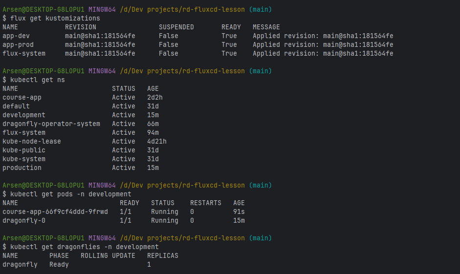
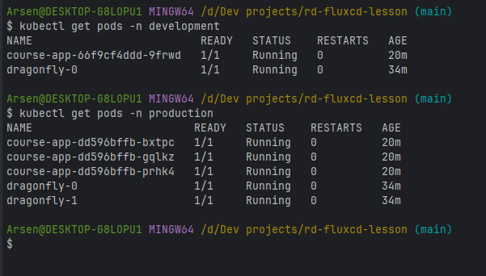
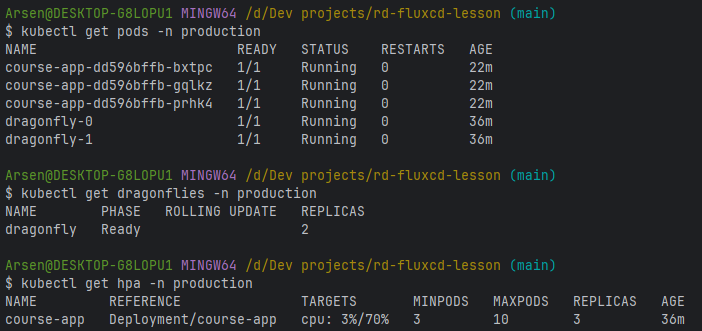
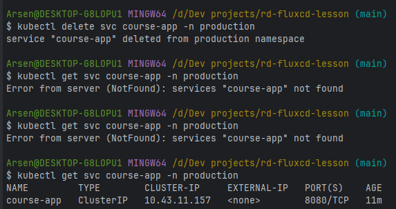

### GitOps підхід. Утиліта fluxcd який його реалізовує

Дз виконане за допомогою доки https://fluxcd.io/flux/, 
статті https://medium.com/@platform.engineers/configuring-fluxcd-for-multi-environment-deployment-in-kubernetes-e164077ef3b6
та ШІ

1. Ресурс Kustomization та GitRepository в статусі Ready

2. Кількість подів в різних неймспейсах

3. Поди в Production оточенні

4. Drift-check

